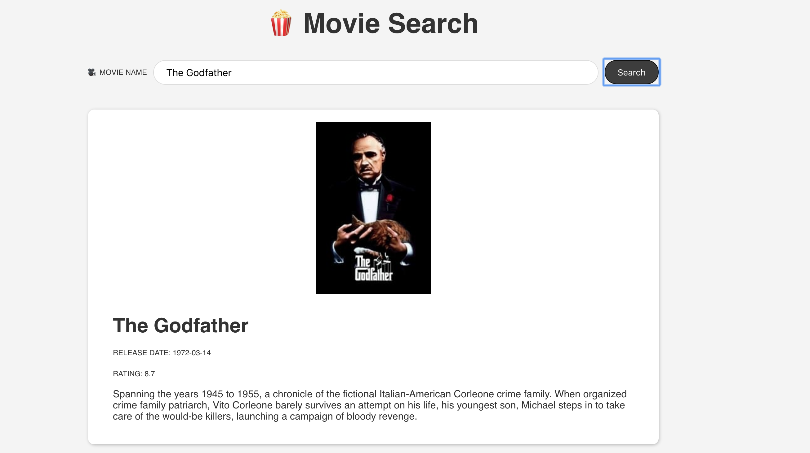

# Movie Search App

> A simple ads free Movie Search Web created with React and the Movie DB API.
>
> [Live demo](https://stefi.codes/movie-search-app/)



I've build this Web App to better understand how I can manage State with the React useState Hook.

Tutorial from [Scrimba](https://scrimba.com/course/greactmovie).

## Technologies

This app was build with:

- [React](https://reactjs.org/docs/create-a-new-react-app.html)
- [Movie DB API](https://www.themoviedb.org/)
- CSS and HTML

## Install

```
git clone https://github.com/stefi23/movie-search-app
$ cd movie-search-app
$ npm install
$ npm start
```
